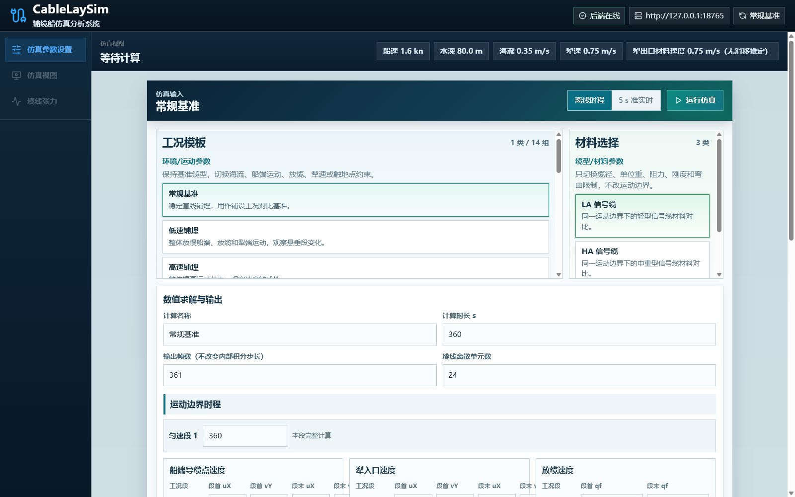

# CableLaySim 海底缆线张力仿真工作台

CableLaySim 是一个开源的海底缆线铺设仿真项目，由 Python 张力求解后端和 React/Three.js 工程前端组成。项目面向铺缆船、放缆系统与埋设犁联合作业，计算缆线三维形态、逐段张力、船端张力、TDP/接触过渡张力和犁入口张力。

当前版本提供离线动态时程和 5 s 周期的有状态准实时计算。准实时会话在新传感器数据到达后从上一帧求解状态继续推进，不会每次从静止状态重新初始化。

> 本项目处于研究与工程验证阶段，不能替代设计审查、船级社认可或现场安全系统。计算结果应结合实测数据和成熟软件进行独立复核。



## 主要能力

- 输入缆材、海床、海流、船端运动、放缆速度和埋设犁运动参数。
- 运行已知船端/犁端边界的三维动态铺缆计算。
- 以 5 s 数据周期接收同步传感器包并连续更新求解状态。
- 查看缆线三维形态、张力颜色分布、船端/TDP/犁端张力和时程曲线。
- 导出 CSV、SVG 和求解诊断数据。
- 提供 MoorPy/MoorDyn 与 OrcaFlex 的离线同口径验证脚本。

## 快速开始

### 环境

- Windows 10/11
- Python 3.11 或更高版本
- Node.js 20 或更高版本（包含 npm）
- Edge、Chrome 或其他现代浏览器

### 一键启动

```powershell
git clone https://github.com/CDHdefans/CableLaySim.git
cd CableLaySim
Set-ExecutionPolicy -Scope Process -ExecutionPolicy Bypass
.\start-workbench.ps1
```

启动完成后访问：

- 前端工作台：<http://127.0.0.1:5173/>
- 后端健康检查：<http://127.0.0.1:8765/api/health>

停止服务：

```powershell
.\stop-workbench.ps1
```

### 手动启动

先安装后端依赖并启动 API：

```powershell
python -m pip install -r backend/requirements.txt
python backend/api/app.py --host 127.0.0.1 --port 8765
```

另开一个终端启动前端：

```powershell
cd frontend
npm ci
npm run dev -- --host 127.0.0.1 --port 5173
```

## 使用流程

1. 在“仿真参数设置”中选择工况模板，或填写材料、环境、运动和数值参数。
2. 离线时程以“总仿真时长”为停止条件；各运动阶段只定义边界速度随时间的变化。
3. 运行后进入三维视图，拖动时间轴查看任意输出时刻的缆线形态和对应张力。
4. 在张力分析中查看船端、TDP/接触过渡位置、犁入口以及沿缆分布。
5. 准实时模式按同步数据包持续推进；前端默认每 5 s 更新一次，后端保留上一周期的节点、速度和活动缆长状态。

## 输入与输出

主要输入：

- 缆材：外径、空气中单位长度重量、水中单位长度重量、轴向刚度、阻力系数、最小弯曲半径。
- 船端：导缆点位置与速度；现场数据可由 GNSS/DP、INS/MRU、艏向和导缆点杆臂换算。
- 犁端：犁入口位置与速度；现场数据可由 USBL、DVL/INS、深度传感器和入口杆臂换算。
- 放缆：累计放缆长度或放缆速度。
- 环境：海流矢量、海水密度、重力、海床深度、接触与摩擦参数。

主要输出：

- 每个物理输出时刻的节点三维坐标与节点速度。
- 逐段张力、船端张力、TDP/接触过渡张力和犁入口张力。
- 海床接触状态、活动悬垂长度、最小弯曲半径和求解诊断量。
- 时程 CSV、沿缆分布 CSV 及 SVG 图形。

详细字段见 [后端输入输出说明](backend/docs/INPUT_OUTPUT.md)。

## 算法概览

模型采用已知船端导缆点和埋设犁入口运动边界。首帧由固定端悬链线建立初始形态；时域推进考虑水中自重、Morison 阻力、节点惯性、XPBD 轴向约束与海床接触。活动悬垂长度由放缆通量、犁端铺底转移及端点几何可达性共同更新。

- [公式推导（Markdown）](docs/formula-derivation.md)
- [算法原理、参数标定与优化路线（Word，含对比图）](docs/formula-derivation.docx)
- [核心算法阅读说明](backend/docs/ALGORITHM_GUIDE.md)

## 验证边界

OrcaFlex、MoorDyn 和 MoorPy 只用于同输入、同物理时刻、同输出定义的离线精度对比，不属于运行依赖，也不随本仓库分发。项目不会包含任何 OrcaFlex 安装文件、模型许可证或商业软件数据。

建议用 60 s 动态窗口对比船端、TDP 和犁端张力曲线，并在 10 s、30 s、60 s 比较沿缆张力分布。性能验收则单独记录项目求解器的墙钟耗时，不用成熟工具的计算速度代替准实时能力证明。

## 目录结构

```text
CableLaySim/
├─ backend/          Python 求解器、HTTP API、验证脚本和测试
├─ frontend/         React/TypeScript/Three.js 工程工作台
├─ docs/             正式公式推导与公开技术文档
├─ start-workbench.ps1
└─ stop-workbench.ps1
```

- [后端 README](backend/README.md)
- [前端 README](frontend/README.md)
- [文档索引](docs/README.md)
- [贡献指南](CONTRIBUTING.md)
- [安全说明](SECURITY.md)

## 测试

```powershell
python -m pip install -r backend/requirements.txt
python -m unittest discover -s backend/tests -v

cd frontend
npm ci
npm test -- --run
npm run build
```

GitHub Actions 会在每次提交和 Pull Request 中执行上述核心检查。

## 参与贡献

欢迎提交可复现的工况、传感器数据适配、数值算法改进、测试、可视化和文档修订。涉及张力算法的改动，请同时说明物理假设、输入单位、坐标约定、输出定义和对比证据。详情见 [CONTRIBUTING.md](CONTRIBUTING.md)。

## 许可证

本项目采用 [MIT License](LICENSE)。
